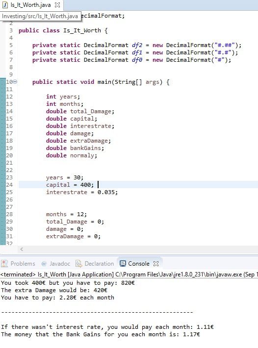

A simple BUT important Java code!
You put the data that matters on you. Interest Rate, Years you will pay, Capital,... You make the alterations on the code based on your needs.

- Result: Calculates the interest rates and not only!

 
<b>Example:</b>
 

